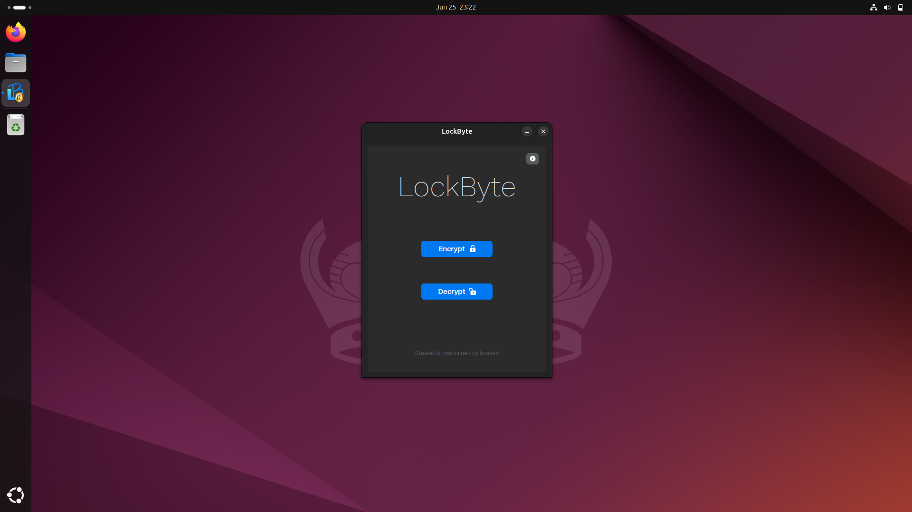
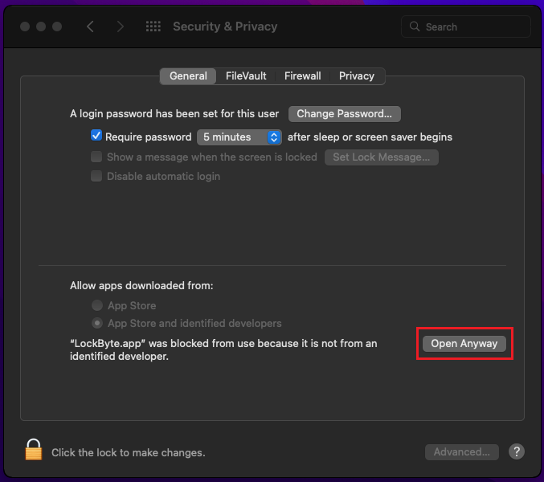

<p align="center">
  
  
</p>

<div align="center">

[](https://github.com/bose-kb/LockByte/releases)
[](https://www.python.org/downloads/)
[](https://www.gnu.org/licenses/gpl-3.0.en.html#license-text)
[](https://github.com/bose-kb/LockByte)


</div>

<h1 align="center"> Secure Files, Simplified 🔑 </h1>

LockByte is an easy-to-use, open-source file encryption application designed to cater to the needs of individuals who prioritise data security and want to protect their data without dealing with complex software. At present, LockByte supports *Windows*, *Linux*, and *Mac*.

Features of LockByte:

- 🛡️ It utilizes **AES-256 encryption**, the gold standard in symmetric encryption, to ensure your files are securely locked away. AES-256 is known for its robustness and is used globally by governments and security-conscious industries.

- 🔒 To complement AES-256, LockByte employs **Argon2 password hashing**. Argon2 is the winner of the Password Hashing Competition in 2015 and is renowned for its resistance to GPU cracking attacks, providing an additional layer of security.

- 🎯 Despite its advanced security features, LockByte remains accessible to users of all technical backgrounds. The user interface is intuitive, making the process of encrypting files as simple as selecting a file, entering a password, and initiating the encryption process.

## Screenshots

<details>
<summary>Light/dark theme support (Click to view).</summary>
&nbsp

|              Dark Mode                        |               Light Mode                             |
|-----------------------------------------------|------------------------------------------------------|
|  |  |
|  |  |
</details>

<details>
<summary> Cross-platform support (Click to view).</summary>
&nbsp


*`Windows`*


*`Linux`*


*`MacOS`*

</details>

<details>
<summary>Drag & drop support (Click to view).</summary>
&nbsp

|              Normal File D&D                      |                 Encrypted File D&D                        |
|---------------------------------------------------|-----------------------------------------------------------|
| | |

</details>

## Installation

You can install the application via the platform-specific installers **(recommended)** or as a Python package.

### Standalone Installers

- Windows: [lockbyte_setup.exe](https://github.com/bose-kb/LockByte/releases/latest)
- Linux: [lockbyte_installer.run](https://github.com/bose-kb/LockByte/releases/latest)
- macOS: [lockbyte_installer.pkg](https://github.com/bose-kb/LockByte/releases/latest)

> [!TIP]  
> Since the standalone installers have not been signed (due to the additional cost required to do so), you may get warnings like *Microsoft SmartScreen* warnings on Windows,  *Gatekeeper* warnings on macOS, and a *disabled desktop launcher* shortcut problem on Linux. 
>No need to worry, the installers and executables are completely safe. Check the collapsed sections below for respective workarounds to these problems. 

>[!CAUTION]
>Please ensure the installers you download come directly from this repository.

<details>
<summary>Microsoft SmartScreen Warnings</summary>
&nbsp

|              Description                      |                 Issue                         |           Solution                            |
|-----------------------------------------------|-----------------------------------------------|-----------------------------------------------|
|When you download the setup file, your browser presents you with `file not commonly downloaded` warning. **Solution**: Choose the `keep` option. |||
|When you try to keep the downloaded setup file, your browser presents you with *`Microsoft Defender Smarscreen couldn't verify file`* warning. **Solution**: Click on *Show more --> then choose `keep anyway` option.* |||
|When you try to launch the setup file, you are presented with *`Windows protrcted your PC`* warning. **Solution**: Click on *More info --> then choose `Run anyway` option.* |||

</details>

<details>
<summary>macOS Gatekeeper Warnings</summary>
&nbsp

|              Description                      |                 Issue                         |           Solution                            |
|-----------------------------------------------|-----------------------------------------------|-----------------------------------------------|
|When you download and try to launch the package installer, you are presented with *`macOS cannot verify developer`* warning. **Solution**: First Close the pop-up. Then open *System Preferences --> Privacy & Security --> choose *`open anyway`* option.* |||
|When you try to launch the app post installation, you are presented with *`Apple cannot check for malicious software`* warning. **Solution**: First Close the pop-up. Then open *System Preferences --> Privacy & Security --> choose *`open anyway`* option.* |||

|              Description                      |                 Help Image                         |
|-----------------------------------------------|----------------------------------------------------|
|You should now get the option to *open* the application bypassing the warning message.||

</details>

<details>
<summary>Linux Warnings</summary>
&nbsp

|              Description                      |                 Help Image                    |
|-----------------------------------------------|-----------------------------------------------|
|Post installation, the newly created desktop shortcut is greyed out. **Solution**: Right click and select *Allow Launching* option to fix this problem. ||

</details>

### Package Installation

To install the lockbyte package using pip run:

```bash
  pip install git+https://github.com/bose-kb/LockByte.git@main
```

To launch the GUI app after installation, run:

```bash
  lockbyte-gui
```
### Cloning Repository

To clone this repository on your local machine run:

```bash
  git clone https://github.com/bose-kb/LockByte.git
```

> [!NOTE]  
> If instead of using pip, you decide to clone the repository to your local machine, please uncomment line 23, and comment out line 22 of [`app.py`](src/lockbyte/app.py) to ensure proper module imports.

## App Demo

<details>
<summary>Encryption Steps</summary>

1. Launch the *LockByte app*.
2. Click on the *Encrypt* button on the starting screen.
3. Choose a *File or Folder* whose contents you want to encrypt.
4. Enter a *password* of your choice (**six characters minimum**).
5. Click on the *Encrypt* button at the bottom.
6. *Re-enter* the password and click on the *confirm* button to confirm. *Optionally* you can choose to *keep or delete* your original file(s) post encryption.
7. Once the encryption process is over a *new file* with a `.lockbyte` extension appears in the *same directory* as your chosen file. In case a folder was provided, *all file(s)* inside the *folder* as well as *sub-folder(s)* will get encrypted and saved as *new file(s)* with a `.lockbyte` extension. 
8. You can now delete the original files, (if not already opted to in *Step 6*) and store only the encrypted `.lockbyte` files.
</details>

<details>
<summary>Decryption Steps</summary>

1. Launch the *LockByte app*.
2. Click on the *Decrypt* button on the starting screen.
3. Choose a *File or Folder* whose contents you want to decrypt.
4. Enter the *password* you used during encryption.
5. Click on the *Decrypt* button at the bottom.
6. Once the decryption process is over a *new file* with `_decrypted` suffix appended to the file name appears in the *same directory* as your chosen file. In case a folder was provided, *all file(s)* inside the *folder* as well as *sub-folder(s)* will get decrypted and saved as *new file(s)* with `_decrypted` suffix appended to the file names.
</details>


https://github.com/bose-kb/LockByte/assets/85823329/b8247b77-3439-4515-9920-7b9669c9d690


*`A quick demo of the application functionality.`*

## Example Program

You can use the `lockbyte.lock_unlock` module to perform encryption and decryption of files.

| Parameter   | Type     | Description                |
| :--------   | :------- | :------------------------- |
| `file_path` | `str`    | Path to your file |
| `file`      | `_io.BufferedReader` | Opened file object |

#### Encryption 

```python
from lockbyte import lock_unlock

user_password = "abcd"  # pick a password

# create an instance of LockByteUser
user = lock_unlock.LockByteUser(passphrase=user_password)
file_path = "test.txt"  # provide path to file to be encrypted

with open(file_path, "rb") as file:
    if user.validate_and_generate(1):  # call validation function
        # call encryption function
        user.encrypt(file=file, file_path=file_path)
```
#### Decryption 

```python
# create another instance of LockByteUser
user = lock_unlock.LockByteUser(passphrase=user_password)
file_path = "test.txt.lockbyte"  # provide path to file to be decrypted

with open(file_path, "rb") as file:
    # call decryption function
    user.decrypt(file=file, file_path=file_path)

```

## App Workflow

High-Level Overview:


Detailed Overview of Encryption Request:


Detailed Overview of Decryption Request:


If you would like to better understand the above workflows and want to learn more about the algorithms in use, checkout [`ALGORITHMS.md`](docs/ALGORITHMS.md).

### Tech Stack

- Python3.
- CustomTkinter for GUI.
- argon2-cffi for password hashing.
- pycryptodome for encryption/decryption.


## License

This program (*LockByte*) is free software: you can redistribute it and/or modify it under the terms of the [GNU General Public License](https://www.gnu.org/licenses/gpl-3.0.en.html) as published by the Free Software Foundation, version 3 of the License.

This program is distributed in the hope that it will be useful, but **WITHOUT ANY WARRANTY**; without even the implied warranty of **MERCHANTABILITY or FITNESS FOR A PARTICULAR PURPOSE**. See the [LICENSE](LICENSE) for more details.

While *LockByte* is designed to secure your files, the **author does not assume any responsibility or liability** for the **loss or damage of data** due to its use. Users are strongly advised to **back up their data regularly** and not solely rely on the application for data security.

Fonts used are under the [SIL Open Font License (version 1.1)](https://openfontlicense.org/documents/OFL.txt) & [Creative Commons CC0 License (version 1.0)](https://creativecommons.org/publicdomain/zero/1.0/).

Icons used are from [Icons8](https://icons8.com/).

By using *LockByte*, you acknowledge that you **understand and agree** to this disclaimer.

## Contributing

Your contributions are highly valued! If you wish to propose a new feature or report a bug, please feel free to contribute to the project. Contributions are always welcome!

See [`CONTRIBUTING.md`](docs/CONTRIBUTING.md) for ways to get started.

Please adhere to this project's [`code of conduct`](docs/CODE_OF_CONDUCT.md).


## Feedback

If you have any feedback, please reach out to me via [LinkedIn](https://linkedin.com/in/bosekb).
