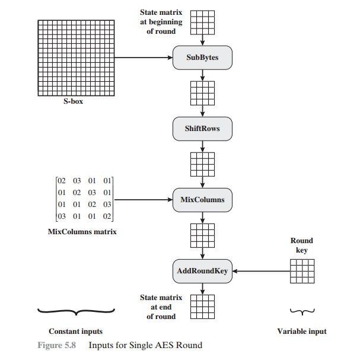

# Crypto Algorithms Utilized 🛡️

This section aims to discuss the various cryptographic algorithms used in this project and also justify thier use. The three main algorithms utilized are:

- Argon2, a modern password hashing algorithm.
- scrypt, a slow-by-design key derivation function.
- AES-256, a standard symmetric encryption algorithm.

## Argon2 (Password Hashing) #️⃣

*Argon2* is a key derivation function that was selected as the winner of the 2015 Password Hashing Competition. It was designed by Alex Biryukov, Daniel Dinu, and Dmitry Khovratovich from the University of Luxembourg. Argon2 has the following variants:

- **Argon2d:** Argon2d is faster and uses data-depending memory access, which makes it suitable for cryptocurrencies and applications with no threats from side-channel timing attacks.

- **Argon2i:** Argon2i uses data-independent memory access, which is preferred for password hashing and password-based key derivation. Argon2i is slower as it makes more passes over the memory to protect from tradeoff attacks.

- **Argon2id:** Argon2id is a hybrid version. It follows the Argon2i approach for the first half pass over memory and the Argon2d approach for subsequent passes. 

*This project utilizes the Argon2id variant of Argon2.*

Argon2 plays a crucial role in the *authentication system* of this project. It was chosen due to it being **MEMORY HARD**, a property that most traditional algorithms like *PBKDF2, bcrypt* etc. don't satisfy, while delivering **HIGH PERFORMANCE**, which is not necessarily guranteed with algorithms like *scrypt*. 

First the `os.urandom()` function is called that returns random bytes from an OS-specific randomness source, to generate a 32-byte salt. This salt is fed as an input to the hashing object (`argon2.PasswordHasher`) along with the user password. The hashing object generates a unique hash for the supplied password which is encoded along with the salt and some additional parameters in the form of a string of the following format:

```bash
 '$argon2_VARIANT$v=VERSION_NUMBER$m=MEM_PARAM,t=TIME_PARAM,p=PARALLELISM_PARAM$SALT_USED$HASH_GENERATED'
 ```

This encoded string is appended to the beginning of the encrypted file, as part of the header.


## scrypt (Password Based Key Derivation) 🗝️

The *scrypt*, a key derivation function was originally developed for use in the Tarsnap online backup system and is designed to be far more secure against hardware brute-force attacks than alternative functions such as *PBKDF2 or bcrypt* by requiring large amounts of memory. It is a **MEMORY HARD** algorithm.

Scrypt’s **MEMORY-INTENSIVE** nature makes it more resilient against custom hardware attacks. The large memory requirements of scrypt come from a large vector of pseudorandom bit strings that are generated as part of the algorithm, which makes it challenging for attackers to parallelize computations effectively.
Keeping in mind the time–memory trade-off of scrypt, it was chosen as the *KDF(Key Derivation Function)* for this project.

The 32-byte salt generated previously along with the user password are passed to the KDF, in this case an instance of scrypt (`Crypto.Protocol.KDF.scrypt`), which then generates a uniqiue 256-bit key that will be used in the encryption process.


## AES (File Encryption) 🔐

*AES* stands for **Advanced Encryption Standard** which can be thought of as a successor to *DES* (**Data Encryption Standard**). AES is right now the de-facto symmetric encryption algorithm used in most applications. It is a 128-bit block cipher that supports three key lengths (128/192/256). 

The number of rounds depend on the key length.
| Key Length  | No. of Rounds|
| :---------- | :----------- |
| 128         | 19           |
| 192         | 12           |
| 256         | 14           |

*For this project, in order to maximize security, a 256-bit key length was chosen.*

The rounds are composed of the following four byte-oriented 
transformations on the state:

### 1. SubBytes



In this step, each byte of the input block is replaced with a corresponding byte from a fixed lookup table (S-box). It provides non-linearity and confusion in the cipher.

### 2. ShiftRow

The rows of the 4x4 state array are shifted cyclically. The first row remains unchanged, the second row shifts one position to the left, the third row shifts two positions, and the fourth row shifts three positions. This diffusion ensures that each byte influences multiple columns.

### 3. MixedColumn (skipped in the Nth round)

Within each column of the state array, a linear mixing operation is performed. Each column is treated as a polynomial, multiplied by a fixed matrix, and reduced modulo a polynomial. This step provides diffusion across columns.

### 4. Key Addition

The round key (derived from the original encryption key) is bitwise XORed with the state array. This step introduces the key material into the cipher.


As demonstrated earlier, a 256-bit key generated by the KDF along with a randomly generated 16-byte initialization vector is used to initialize the cipher object. The cipher is operated in ***CBC(Cipher Block Chaining)*** mode, which is why this initialization vector is required. In order for the input file to be correctly encrypted, the file size needs to be some multiple of the block size (128-bit). The file contents are thus padded (`Crypto.Util.Padding.pad`) using ***PKCS#7*** padding scheme and then given to the cipher instance to encrypt. 


The 16-byte initialization vector is also appended to the beginning of the encrypted file thus completing the file header. The file header and the encrypted file contents are then written back to the disk with a `.lockbyte` extension. 


*Complete overview of the encryption process.*

The decryption process takes place in a similar fashion where the encoded password hash and the 16-byte initialization vector are extracted from the encrypted file header. The 32-byte salt is then extracted from the encoded password hash. 


*Complete overview of the decryption process.*

The 32-byte salt along with the supplied password is then fed to an Argon2 hashing object to generate the password hash. This password hash is then compared with the extracted hash from the encrypted file. Upon a successful match, the 256-bit key to be used for decryption is regenerated from the password and the extracted salt. A cipher object is then initialized with the extracted 16-byte initialization vector, 32-byte salt and the generated 256-bit key. The cipher object then decrypts the file and the decrypted contents are written back to the disk with an appropriate `_decrypted` suffix attached to the original filename.

## Additional Resources 📖

If you would like to learn more about these algorithms, check out the resources listed below.

- [Argon2 Specification](https://www.cryptolux.org/images/0/0d/Argon2.pdf)
- [Argon2 Wikipedia](https://en.wikipedia.org/wiki/Argon2)
- [Argon2 Github Repository](https://github.com/p-h-c/phc-winner-argon2)
- [scrypt Specification](https://www.rfc-editor.org/rfc/rfc7914)
- [scrypt Wikipedia](https://en.wikipedia.org/wiki/Scrypt)
- [AES Specification](https://csrc.nist.gov/pubs/fips/197/final)